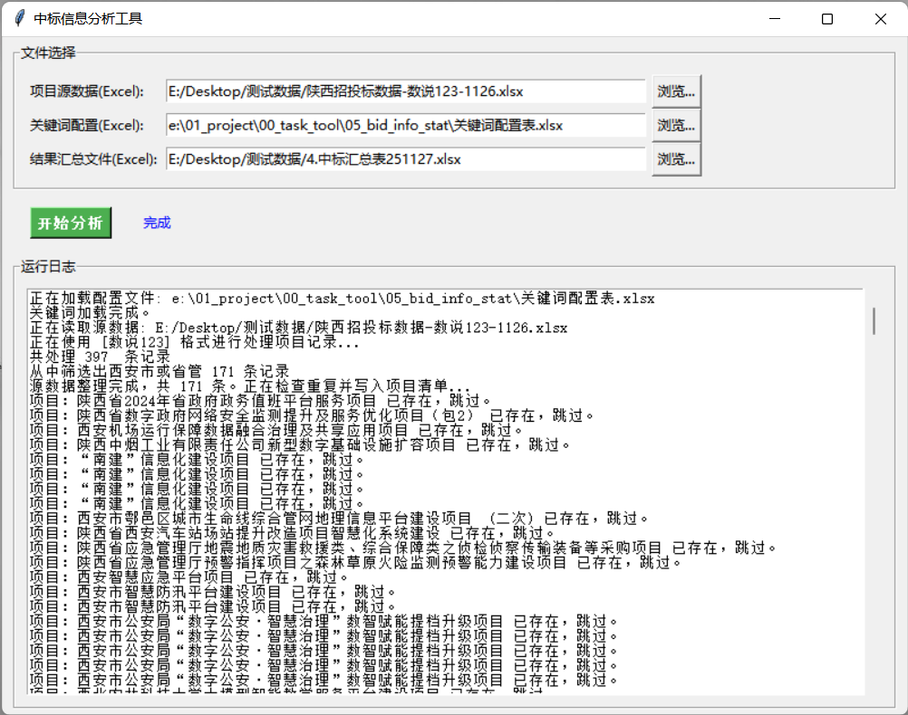

# 中标数据分析工具使用说明书

## 1. 工具简介

本工具旨在帮助用户快速处理中标项目数据，实现自动化的数据清洗、去重、分类及统计汇总。用户只需提供源数据文件和汇总底表，工具即可自动生成部分统计结果

## 2. 准备工作

在使用本工具前，请确保您已准备好以下文件：

### 2.1 数据源文件

支持以下三种来源的 Excel 文件，**文件名必须包含对应的关键词**以便工具自动识别：

- **省公司数据**：文件名需包含“**派单分析**”
- **数说123数据**：文件名需包含“**数说123**”
- **ICT标局数据**：文件名需包含“**ICT**”

> **注意**：
>
> - 对于“数说123”数据，请务必提前**取消合并单元格**，并将包含多个分包的同一项目拆分为多行数据。
> - 对于“数说123”数据，由于中标时间缺失，需**在源数据中手动添加中标年份、中标月份**，以便支撑后续统计
> - 建议数据源文件中仅保留本次需要处理的新增项目，以提高处理速度

### 2.2 关键词配置文件

- 文件名通常为 `关键词配置表.xlsx`
- 该文件用于定义厂商类型（如电信、移动等）和行业分类（如党政、金融等）的匹配规则

### 2.3 项目汇总文件

- 这是历史项目数据的汇总表（底表），工具将在其基础上追加新项目
- 请确保该文件未被其他程序（如 Excel）打开

### 2.4 公司汇总文件

- 这是人工完成项目所属行业、分包项目金额校核后的项目汇总文件，工具将在其基础上更新公司统计数据
- 请确保该文件未被其他程序（如 Excel）打开

## 3. 操作步骤

### 第一步：启动程序

双击运行 `bid_analysis_tool_v2.exe`

### 第二步：选择项目汇总用到的文件

程序启动后会弹出操作界面，请按照提示依次选择文件：

1. 点击“**选择源文件**”：选中您准备好的中标数据 Excel 文件
2. 点击“**选择配置文件**”：选中 `关键词配置表.xlsx`
3. 点击“**选择项目汇总文件**”：选中您的项目汇总 Excel 文件

### 第三步：项目汇总

确认文件选择无误后，点击界面上的“**项目汇总**”按钮

- 界面右侧（或下方）的状态栏会实时显示当前的处理进度（如“正在读取数据”、“正在去重”、“正在写入文件”等）

### 第四步：查看项目汇总结果

- 当界面提示“**成功**”时，工具会自动在汇总文件所在的目录下生成一个新的 Excel 文件。
- 新文件名包含当前日期时间后缀（例如：`汇总表_更新项目_20231128_1030.xlsx`），以避免覆盖原始文件

### 第五步：校核项目清单页

- 校核[项目所属行业]列
- 同一项目有多个中标公司时，本工具会自动拆分成多行,并在备注中标记为“**分包**”
- 参考[公告内容（ICT）]列或公告具体内容，**手动修正**分包中各公司的中标金额
- 保存文件

### 第六步：选择公司汇总用到的文件

点击“**选择公司汇总文件**”：选中项目清单校核后的汇总Excel文件

### 第七步：公司汇总

确认文件选择无误后，点击界面上的“**公司汇总**”按钮
  
- 界面状态栏实时显示当前进度（如“正在读取所有项目记录...”、“正在更新[全量中标公司]...”等）
- 控制台同步输出详细日志

### 第八步：查看公司汇总结果

- 当界面提示“**成功**”时，工具会自动在汇总文件所在的目录下生成一个新的 Excel 文件
- 新文件名包含当前日期时间后缀（例如：`汇总表_更新公司_20231128_1030.xlsx`），以避免覆盖原始文件

## 4. 功能说明

### 4.1 自动去重

工具会根据以下规则自动判断项目是否重复：

- 招标单位、中标单位、中标金额完全相同。
- 且项目名称的核心短语重复度超过 **85%**
- 重复的项目将被自动过滤，不会重复录入

### 4.2 自动分类

工具会根据配置文件自动分析：

- **厂商类型**：自动识别电信、联通、移动、广电或其他厂商
- **所属行业**：自动归类为党政、金融交通、教育、工业、物联网等行业

### 4.3 项目拆分

同一项目有多个中标公司时，本工具会自动拆分成多行,并在备注中标记为“**分包**”

### 4.4 统计报表更新

工具会自动更新汇总文件中的以下 Sheet：

- **项目清单**：追加本次新增的去重后的项目
- **全量中标公司**：根据项目清单，更新或新增中标公司的累计中标次数和总金额
- **筛后中标公司**：根据项目清单，更新或新增中标总金额大于 **400万元** 的重点关注公司

## 5. 常见问题与解决

**Q1: 点击“项目汇总”或“公司汇总”后提示“PermissionError”或“文件被占用”？**

> **A**: 请检查您的“结果汇总文件”是否正在被 Excel 打开。请关闭该文件后重试

**Q2: 工具提示“未找到匹配的列”或“KeyError”？**

> **A**: 请检查您的源数据文件表头（第一行标题）是否被修改过。工具依赖特定的列名来读取数据

**Q3: 处理后的项目所属行业未分类或分类不准确？**

> **A**: 检查您选择的“关键词配置文件”，更新或添加合适的关键词

**Q4: 为什么生成的“筛后中标公司”里没有数据？**

> **A**: 该表仅显示本次新增且总金额超过 400 万元的公司。如果本次新增数据的金额较小，该表可能为空
