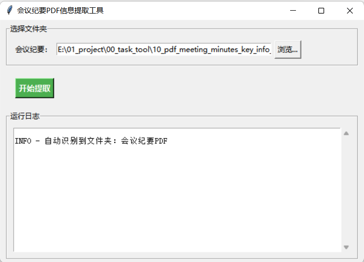
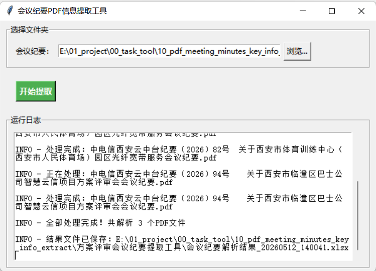

# 方案评审会议纪要 PDF 信息提取工具

本工具用于批量提取会议纪要 PDF 中的关键信息，并将结果导出为 Excel 文件。

## 1. 功能说明

- 批量处理指定文件夹中的 PDF 文件
- 自动提取会议纪要标准模板中的字段内容
- 输出结果为 Excel 表格，包含字段标题和解析结果
- Excel 自动美化，包括表头样式、斑马纹和列宽自适应

## 2. 支持字段

> 工具会按照固定模板提取以下字段：
>
> - PDF文件名
> - 制发单位
> - 签发
> - 编号
> - 页数
> - 会议名称
> - 会议时间
> - 会议地点
> - 参会人员
> - 会议主持
> - 记录人
> - 会议议题
> - 项目名称
> - 客户名称
> - 签约主体
> - 商机编码
> - 项目背景
> - 商机需求
> - 方案内容
> - 业务模式
> - 项目金额、成本、利润率
> - 合同期限
> - 付款方式
> - 要求工期
> - 自研自有能力（云中台解决方案）
> - 方案技术路线可行性（云中台方案+交付/云网小微）
> - 项目运维（云中台方案+交付/云网）
> - 交付工期（云中台交付+采购/云网）
> - 后项采购方式（云中台交付+采购）
> - 采购范围与供应链适配性（采购）
> - 结算方式（云中台交付）
> - 业务场景/模式（政企）
> - 收入构成及列收计划（政企/财务）
> - 风险点识别等（云中台、政企、法务、财务、采购）
> - 主送
> - 主办部门
> - 拟稿人
> - 核稿人
> - 发出时间

## 3. 文件说明

- `方案评审会议纪要提取.exe`：主程序入口，包含 PDF 解析、字段提取和 Excel 导出逻辑。
- `会议纪要PDF`：默认的会议纪要PDF存放文件夹。
- `使用说明.pdf`：使用说明文档。

## 4. 使用方法

### 第一步：双击运行exe文件

`方案评审会议纪要提取.exe`  

### 第二步：在弹出的窗口中

- 系统自动查找当前目录下的`会议纪要PDF`文件夹；
- 如需自定义，请点击“浏览...”选择会议纪要 PDF 所在文件夹；
- 点击“开始提取”开始解析。

### 第三步：解析完成后，结果文件会自动保存到脚本所在目录，文件名类似

`会议纪要解析结果_20260512_091247.xlsx`  

## 5. 使用建议

- 请确保 PDF 文件内容为文本可提取格式，扫描件或图片型 PDF 可能无法正确识别。
- 工具目前依赖固定模板字段顺序，字段书写不规范可能导致部分内容无法提取。

## 6. 常见问题

**Q1: 无法提取文本**  

> **A**: 请确认 PDF 不是图片型文档，并且每页可以正常复制文本。

**Q2: 未找到 PDF**  

> **A**: 请检查所选文件夹路径是否正确，且文件名后缀为 `.pdf`。

**Q3: Excel 保存失败**  
> **A**: 请关闭同名文件或确认脚本目录有写权限
  